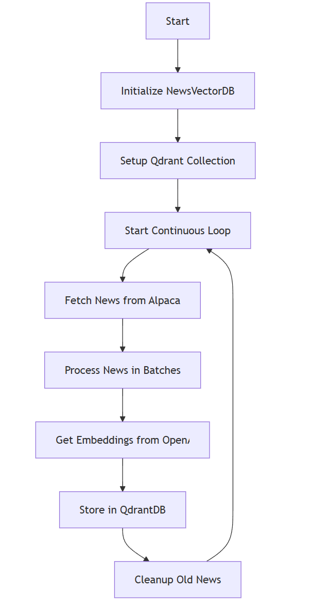
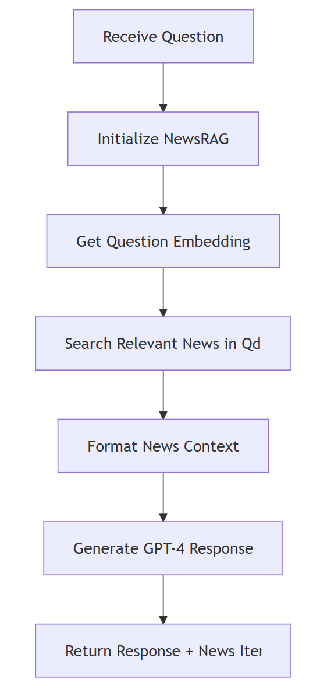

# Financial News RAG System

This project consists of two main components:
1. News Ingestion Service - Continuously fetches financial news from Alpaca and stores it in QdrantDB
2. News RAG Service - Provides question-answering capabilities using the stored news data

## Setup

1. Clone the repository
2. Create a virtual environment:
   ```bash
   python -m venv venv
   source venv/bin/activate  # On Windows: venv\Scripts\activate
   ```
3. Install dependencies:
   ```bash
   pip install -r requirements.txt
   ```
4. Copy `.env.example` to `.env` and fill in your API keys:
   - ALPACA_API_KEY
   - ALPACA_SECRET_KEY
   - QDRANT_API_KEY
   - QDRANT_URL
   - OPENAI_API_KEY

## Running the Services

### News Ingestion Service
```bash
python news_ingestion_service.py
```
This will start the continuous news ingestion process.

### News RAG Service
```bash
python news_rag_service.py
```

### Workflow Logic:

1. News Ingestion Service (`news_ingestion_service.py`):


2. News RAG Service (`news_rag_service.py`):
